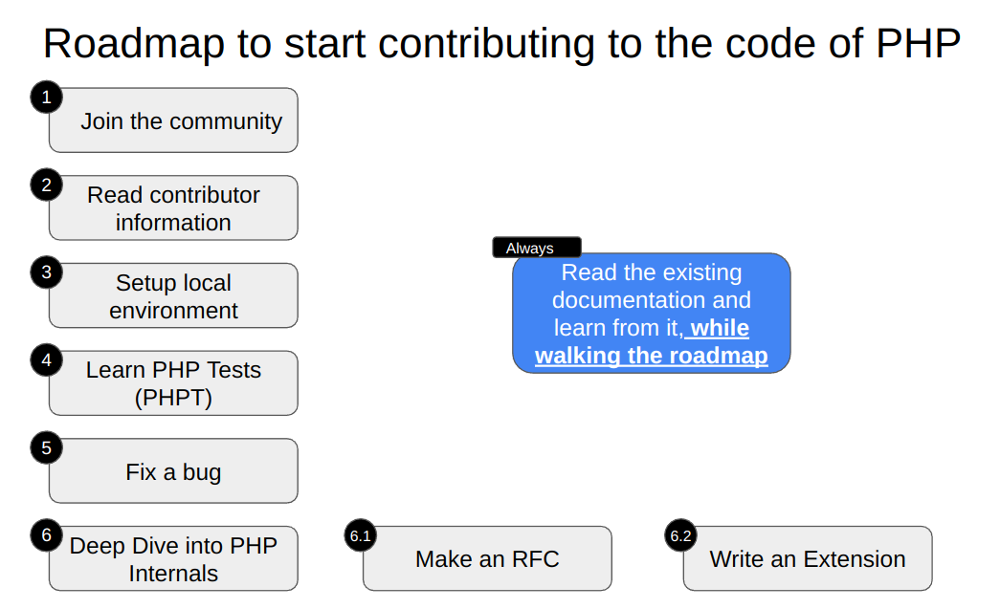

# The PHP Contributor Roadmap

## Roadmap

## Presentations

Formats:

[PPTX](<presentation/PHP Conference Brasil 2024.pptx>) - 8.4 MB

[PDF](<presentation/PHP Conference Brasil 2024.pdf>) - 6.1 MB

[ODP](<presentation/PHP Conference Brasil 2024.odp>) - 8.4 MB

## Resources

### Internals
- PHP Internals Book: https://www.phpinternalsbook.com/ 

- Book: Extending and Embedding PHP by Sara Golemon

### Official
- Github discussions and pull requests
- Internals mailing list
- Check the already created RFCs and their implementation
- https://wiki.php.net/internals/extensions
- https://qa.php.net/write-test.php
- https://www.php.net/get-involved.php
- https://wiki.php.net/rfc/howto
- https://qa.php.net/write-test.php
- http://doc.php.net

### Extra
- Use AI tools like ChatGPT
- Nikita Popov https://www.npopov.com/
- https://github.com/phplang/extension-tutorial
- https://speakerdeck.com/carusogabriel

### YouTube

#### Gina Banyard - How to contribute to PHP

#### Gabriel Caruso - Contribute to PHP Core

#### PHPKonf 2020 - Ekin Bayar: We want YOU to contribute to PHP

#### Gabriel Caruso: Contributing to PHP's Core – phpCE 2018

#### Sammy Kaye : Writing tests for PHP source

#### PHP Round Table

